# How scanning works

The scanner reads a DiceKey from the camera: 25 dice in a 5x5 box, each showing a letter, a
digit and a rotation. It lives in `Packages/ReadDiceKey/Sources/ReadDiceKey/`, is written in
Swift, and uses only system frameworks: `simd`, CoreVideo and Dispatch. This
document explains what it reads, how, and why it works this way rather than the alternatives
that were measured.

The reference implementation is DiceKeys' own scanner,
[read-dicekey](https://github.com/dicekeys/read-dicekey), written in C++ on OpenCV. This
scanner began as a port of it and still follows its approach to finding and decoding the bars. No code
from it is included, and where this scanner departs from it is described below.

## What it is built for

- **Never read a key wrong.** A misread face derives different secrets, silently. Every rule
  below leans toward reading nothing rather than guessing.
- **Read a well-framed key within a few frames on a phone,** and leave the phone cool doing it.
- **Stay small enough to maintain:** Swift, no dependencies, and system frameworks only where
  they measurably do the job.
- **Not a goal: photos far outside what the scanning overlay asks for.** A steep tilt, blur or
  a cropped key may read nothing, but must never read wrong.

## What a face carries

Every face has two layers of information.

- **For people:** a letter (A to Z, without Q) and a digit (1 to 6).
- **For machines:** a black bar under the text (the underline) and one over it (the
  overline). Each bar has 11 dot positions; a white dot is a 1. Read from the letter end, the
  11 bits are a 1, a flag that is set on the overline, an 8-bit code, and a 0.

```
            letter end ─────────────────────────────► digit end
  dot:        1      2         3  4  5  6  7  8  9  10     11
  bit:        1   overline  └──────── 8-bit code ───────┘   0
```

The bars are what the scanner reads, and they carry everything:

- **Which face.** 150 faces use 150 of the 256 underline codes and 150 of the 256 overline
  codes.
- **Which way it is turned.** The 1 is at the letter end and the 0 at the digit end, so the
  direction the bits run is the direction the face reads.
- **A cross-check.** A face's two codes are different numbers that name the same face. Any
  one code is only one bit away from another valid code, so a single line can be misread
  without anything noticing. But turning one face into another *with both lines agreeing*
  takes at least four bit errors spread over the right dots of both lines; every face is
  exactly four errors from its nearest neighbor.

A face counts as read only when its underline and overline name the same face. Over the
photo corpus that rule has never accepted a wrong face.

The 150 faces with their codes, and the whole printed layout, are in the `DiceKeySpecification`
module, generated by DiceKeys' specification generator (written in TypeScript). The scanner
reads with it and the app draws dice from it.

## The pipeline

Each camera frame goes through five steps.

```mermaid
flowchart LR
    A["Camera frame (Y'CbCr)"] -->|"1. centered square of the luma plane"| B[Gray image]
    B -->|"2. 12 thresholds, keep bar-shaped dark regions"| C[Bars]
    C -->|"3. sample 11 dots, decode"| D[Undoverlines]
    D -->|"4. pair lines, fit the 5x5 grid"| E[Faces in 25 slots]
    E -->|"5. merge with earlier frames"| F[DiceKey]
```



### 1. The frame (`GrayImage.swift`, app `CameraSession`)

The camera delivers bi-planar Y'CbCr. Its first plane is luma, which already is the grayscale
image the scanner needs, so the scanner takes the centered square of it (what the square
preview shows) with one copy per row. AVFoundation rotates the buffers to match the preview
before they arrive, so the scanner works in the coordinates the user sees.

### 2. Finding bars (`Bars.swift`, `Regions.swift`)

A bar is dark against its own die, but the light across a key is rarely even: glare on one
corner, a shadow over another. No single brightness threshold separates every bar from its
die, but for each bar some threshold does. So the frame is thresholded at twelve levels
(`k * 255 / 13` for k = 2 to 13, skipping levels above the brightest pixel), and at each the
dark pixels are grouped into regions: runs of dark pixels along each row, joined where runs in
neighboring rows share a column. At the right level, each bar is a region of its own.

Each region of at least 50 pixels is fitted with its smallest enclosing rectangle (one side
lies along an edge of its convex hull), and kept if it has an undoverline's proportions: 0.177
as thick as it is long, with 50% slack either way. The levels are independent, so they run in
parallel.

Most regions are not bars (paper texture, the box, letters, the scene), so two facts about a
key thin them out:

- **All 50 bars are the same size.** The areas are sorted and the tightest run of 35 found;
  only candidates within 25% of its middle area stay. A tight run of much larger rectangles
  wins over a tight run of tiny ones, so specks of equal size cannot outvote the bars.
- **A bar is found at several thresholds.** Of overlapping candidates (either's center inside
  the other), the one closest to that area stays.

### 3. Reading a bar (`Undoverline.swift`)

The line through the middle of the rectangle is stretched 3% each way and pulled back to the
first dark pixel at each end, because a rectangle found at one threshold can include a little
of what the bar touches. The 11 dots are sampled along it, each the median of up to 21 pixels
around its center (fewer when the dots are small), and split into dark and light at the
brightness that leaves the two groups tightest, with at least four dots on each side (every
code has 4 to 7 light dots). The bits decode into the face, whether it is an underline or an
overline, and which end is the letter end.

### 4. Assembling the grid (`Grid.swift`)

- **Pairing.** Each line says where its partner should be: 0.82 of a face away, toward the
  text. An underline and an overline that each sit where the other says are one face, when
  the two misses together come to less than a quarter of a face.
- **The grid.** A paired face with at least four others in line along its row and its column,
  evenly spaced both ways, fixes the grid: its center and the step from column to column and
  row to row. Rows are taken to run within 45 degrees of the frame's x axis, so row 0 is the
  top of the key as the camera sees it.
- **Placing.** Every face goes to the grid position within a quarter step of its center. A
  line whose partner was not found says where the partner should be, and it is read there
  directly, which recovers lines too faint or too broken up to be found as rectangles.
- **Rotation.** Each face's turn is its reading direction relative to the grid's rows, in
  quarter turns.

### 5. Across frames (`DiceKeyScanner.swift`)

One frame rarely reads all 25 faces; the scanner keeps what every frame has read. The grid is
fitted afresh each frame, so the key may have turned a quarter turn in between (or been read
that way when held near 45 degrees). The known faces are tried in all four turns, and the turn
that agrees with the new frame on the most faces and disagrees on none is kept. If every turn
disagrees somewhere, the camera is on another key and reading starts over. Five faces in
common are needed to call it the same key, because two keys can share a face or two by
chance. With fewer, whichever of the two reads has more faces stands, so one key is not mixed
into another on a coincidence. Successive frames of a key in view read most of its faces, so
they share far more than five. A frame that reads nothing changes nothing. When all 25 faces are known and name 25 different letters,
the key is read: a DiceKey has one die per letter, and a full sheet of StickKeys stickers,
which repeats five letters, would otherwise read as a key.

## Accuracy and the corpus

`ScannerCorpusTests` runs photos and a short video of keys: upstream's, the owner's (six
keys, one of them printed in the DiceKeys booklet), and scenes with no key. The bar depends on
how a photo was taken, not on who took it:

- **A well-framed key must read** (the photos in `well-framed/`) at the app's scale (the
  shorter side scaled to 1,080 pixels, uncropped, since the photos were not framed through
  the app's square): at least 20 faces from one frame of each such photo, both filling the
  frame and at three quarters of that size, as a key held back to fit the scanning target,
  whose squares take up the middle two thirds of the frame; and a recorded total across
  them all.
- **Everything else must only never be misread** (the photos in `other/`): a steep tilt, low light, blur, a key far away
  under glare, a cropped key, the video at 360 pixels, and scenes with no key at all (loose and
  jumbled dice, printed faces, StickKeys sheets, a sudoku grid), which must read nothing.

Every photo is checked for misreads at full size, at the app's scale and three quarters of
it, and cropped to the centered square exactly as the app scans it. No face has been read wrong in any of them. The
photos far outside what the scanning overlay asks for are there to prove that, not to be read.

## Constants and where they come from

| Constant | Value | Why |
|---|---|---|
| Threshold levels | `k * 255 / 13`, k = 2...13 | Upstream's choice. Spans the range evenly; fewer was never measured |
| Minimum region size | 50 pixels | Drops specks before rectangle fitting; a bar is far larger at any usable distance |
| Bar proportions | 0.177 thick per length, within a factor of 1.5 | The printed geometry, with slack for blur and perspective |
| Size mode | tightest run of 35, keep within 25% | 50 bars of one size; 35 leaves room for missed and extra bars |
| Pairing tolerance | a quarter face | A partner on a neighboring die is about two faces away |
| Row and column tolerance | one face width | Rows are about two face widths apart; generous for perspective |
| Even spacing | each step within 25% of the mean | Rejects a row that picked up a stray |
| Slot tolerance | a quarter step | Unambiguous: slots are a whole step apart |
| Faces in common to merge frames | 5 | Too many to match by chance; frames of a key in view share far more |
| Minimum dark and light dots | 4 and 4 | Every code has at least 4 of each |

## Why it works this way: alternatives measured

The scanner began as a line-by-line Swift port of
[read-dicekey](https://github.com/dicekeys/read-dicekey)'s C++ scanner (lib-read-dicekey,
built on OpenCV), proven to read the corpus exactly as the C++ did. When exact equivalence
stopped being a goal, Apple's frameworks were tried first, on the assumption that they would do
the job with less code. Measured on the 23 corpus photos at 1080 pixels on an M2:

| Approach | Result | Why |
|---|---|---|
| Vision `DetectRectanglesRequest` | 0 to 13 rectangles per frame; even a clean synthetic image of 50 bars gives 8 to 12 at real sizes | Built for a few prominent quadrilaterals (documents, cards). It caps its results per request; tiling the frame into 36 requests found more but still read only 14 faces |
| Vision `DetectContoursRequest` | Full reads on about half the photos; mostly 34 to 270 ms, and 10 s on one | One global threshold, where uneven light needs many. Its cost grows faster than the contour count (at 512 pixels, 430 contours took 23 ms and 2,456 took 3.2 s). Dividing the image by its own blur first fixed much of the lighting but not the speed |
| Vision `RecognizeTextRequest` as the reader | 20 to 49% of faces found in a full frame (56 to 770 ms); given each face's location, 85 to 91% read, with wrong but plausible reads | Built for lines of words, not isolated rotated pairs of characters. It has no error check, needs a detector anyway, and the fast level only reads upright text |
| Template OCR as a third vote (upstream) | Could only veto good reads | Whenever the two codes agreed they were right (all 417 times, on the corpus cropped to the app's 1080-pixel square), and the app already required all three to agree, so OCR added nothing but vetoes. It cost 3,900 lines of glyph tables and matching code |
| The Canny edge level (upstream) | One face more, of 550, from the well-framed photos at the app's frame size | It closes the outline of a bar printed against the edge of its die, and rescued one photo at full photo resolution, which the app never scans. Rendered by Core Image it cost 2.6 ms and ~120 MB per frame; on the CPU (the port's code), 9 ms. Not worth either |
| OpenCV | Would shrink step 2 to a few calls | A large binary dependency to replace the region labeling and rectangle fitting, under 200 lines |
| AprilTag, zxing-cpp | The right family of problem (fiducials, barcodes) | Their decoders are for their own tags and symbologies |
| Core ML detector trained on rendered keys | The only framework route aimed at this problem | Needs a training pipeline and a model to maintain, accuracy unknown, and the bars would still be needed to guarantee correctness |

The pattern: Vision's requests are built for a few salient objects per image or for natural
text, and Apple ships no fast way to find many small blobs. Finding 50 identical small bars
under uneven light and decoding their dots is a fiducial-marker problem, the family of QR codes
and AprilTags, and those detectors are hand-written for their markers too.

## Limitations

- A die whose underline or overline is damaged can never be read, because a face needs both.
  Such a key has to be typed in.
- A frame only counts if some die with both lines found has four more like it along its row
  and its column; a key mostly out of frame reads nothing.
- A steeply tilted key reads nothing: foreshortening brings each die's two lines closer
  together than pairing allows. The scanning overlay asks for the key face on.
- Blur, and the silver reflection a lamp can raise from the etched bars, lose dice for that
  frame; moving the phone brings them back.
- A die turned over while the key is being scanned is noticed only when a frame reads it
  again. Until then the scanner keeps the face it read before.
